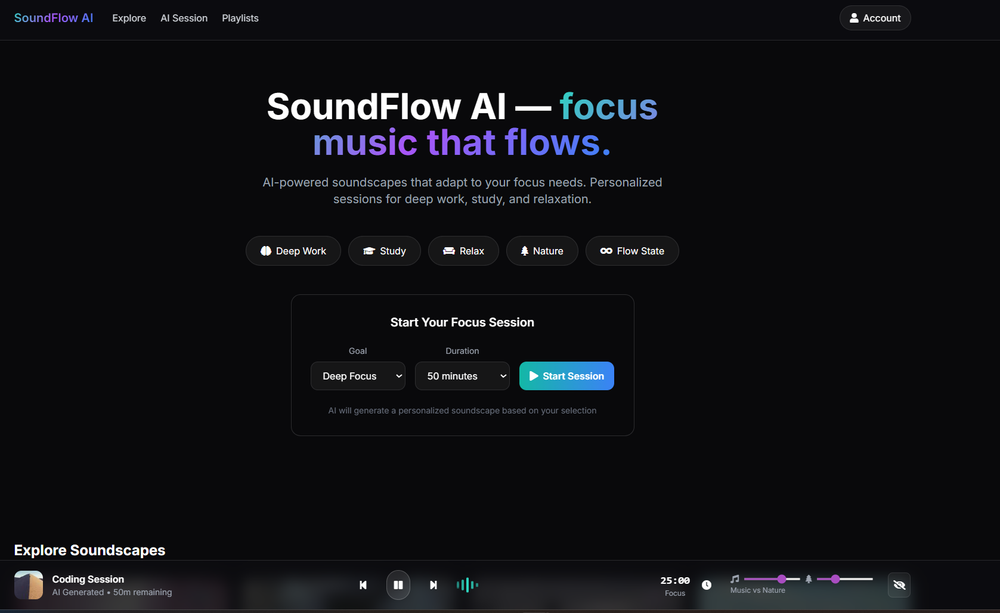

<!--
====================================================
 SoundFlow AI — Enterprise Monorepo
 Created by Ruslan Magana Vsevolodovna
 https://ruslanmv.com
====================================================
-->

<div align="center">

# 🎧 SoundFlow AI  
### Intelligent Focus & Sound Session Platform

🚀 **Enterprise-ready AI-powered focus sessions**  
🎯 Designed for deep work, coding, and reading  
🌐 Scalable monorepo architecture

---

[](#)
[](#)
[](#)
[](#)

⭐ **Click “Star” if you liked this project**

</div>

---




## 📌 Overview


**SoundFlow AI** is a modern, enterprise-grade platform that generates intelligent sound-based focus sessions using AI.  
It is designed with scalability, clean architecture, and cloud deployment in mind.

This repository follows a **monorepo strategy** with independent frontend and backend services.

---

## 🧱 Monorepo Structure

```text
SoundFlow-AI/
├── frontend/   # Next.js App Router (Vercel-ready)
├── backend/    # FastAPI (uv + pyproject.toml)
└── Makefile    # Unified developer commands
````

| Layer       | Technology                | Purpose                        |
| ----------- | ------------------------- | ------------------------------ |
| 🎨 Frontend | Next.js (App Router)      | UI, AI Session Builder         |
| ⚙️ Backend  | FastAPI + Python          | AI logic & sound orchestration |
| ☁️ Deploy   | Vercel / Render / Railway | Cloud-native scaling           |

---

## ⚡ Quickstart

### 🔧 Install All Dependencies

```bash
make install
```

---

### ▶️ Run Locally (Development)

#### Terminal 1 — Backend

```bash
make serve-backend
```

#### Terminal 2 — Frontend

```bash
make serve-frontend
```

---

### 🌍 Local URLs

| Service  | URL                                            |
| -------- | ---------------------------------------------- |
| Frontend | [http://localhost:3000](http://localhost:3000) |
| Backend  | [http://localhost:8000](http://localhost:8000) |

---

## 🚀 Deployment Guide

### 🌐 Frontend (Vercel)

1. Push this repository to **GitHub**
2. Open **Vercel Dashboard**
3. Import the repository
4. Set **Root Directory** → `frontend`
5. Click **Deploy**

✅ Zero-config deployment

---

### 🔌 Backend (Later Deployment)

Deploy the `backend/` directory to any of the following:

* 🟢 Render
* 🟢 Railway
* 🟢 Google Cloud Run
* 🟢 VPS / Docker

After deployment, configure the frontend:

```env
PYTHON_API_URL=https://your-backend-host
```

The frontend route:

```text
/api/session
```

automatically proxies requests to the backend API.

---

## 🔐 Enterprise-Ready Features

✔️ Clean separation of concerns
✔️ Cloud-native deployment
✔️ AI session orchestration
✔️ Production-ready FastAPI setup
✔️ Scalable Next.js App Router
✔️ Environment-based configuration

---

## 🧠 Designed For

* 🧑‍💻 Developers
* 📖 Researchers & Readers
* 🧠 Deep-work professionals
* 🏢 Enterprise teams
* 🎧 Focus & productivity products

---

## 👤 Author

**Ruslan Magana Vsevolodovna**
🌐 [https://ruslanmv.com](https://ruslanmv.com)

> Enterprise software architect & AI engineer

---

## ⭐ Support the Project

If you found this project useful:

* ⭐ **Star the repository**
* 🔁 Share it with your team
* 🧠 Build something amazing with it

---

<div align="center">

### 🎵 SoundFlow AI

**Focus. Flow. Perform.**

</div>
```
